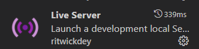
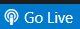

# 动画效果

使用anime.js来做。

## 展示方法：

若您使用`visual studio code`，则可以安装插件Live Server以展示。

图示：

安装完成后，在右下角会出现一个`Go Live`图标。、

图示：

点击即可展示。显示效果如下图：

## 参考：
1. https://codepen.io/Paolo-Duzioni/pen/jvrxpL
2. https://codepen.io/juliangarnier/pen/aWERWX
3. https://codepen.io/allen-bayern/pen/abwodyo
4. https://codepen.io/ainalem/pen/mLqvee

## 分支信息：

1. `master`分支：必须为当前可以稳定运行的版本；
2. `dev`分支：**开发中**，用来折腾新功能；
3. `res0`分支：使用es5的稳定运行版本；
4. `res1`分支：使用es6特性的新版本，浏览器容易崩；
5. `res1_rew`分支：**开发中**，对`res1`分支重写，通过`babel`或`TypeScript`等手段以求es6代码可以运行。写成之后与`res1`分支合并并删除。